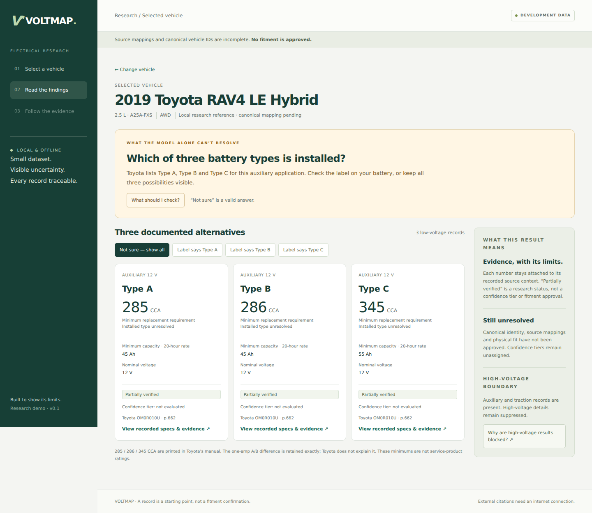
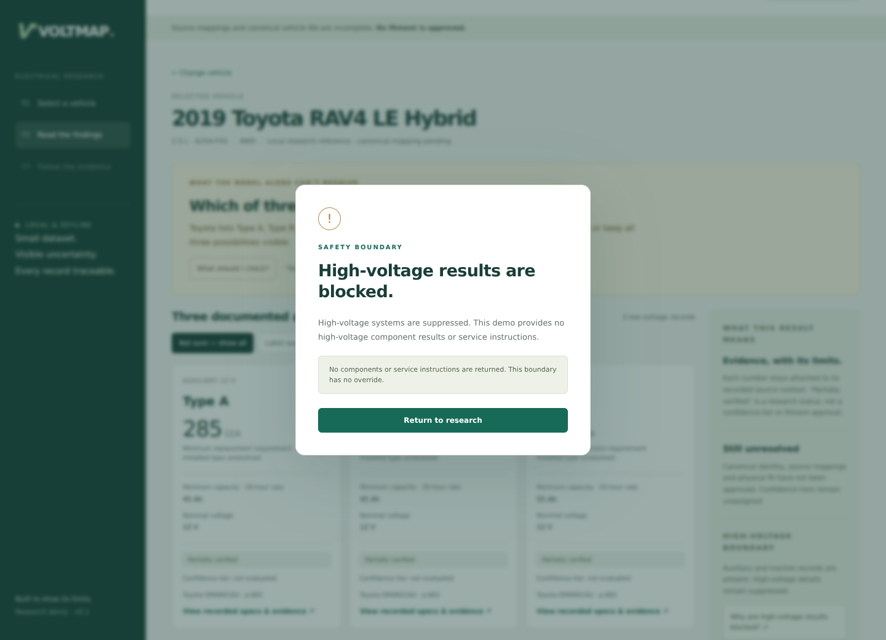

# VOLTMAP

**A vehicle electrical compatibility system that shows its evidence — and says when it doesn't know.**

Most parts lookups answer every question with the same confidence, whether they're certain or guessing. VOLTMAP does the opposite: every stored specification traces back to a source document and page, unresolved ambiguity is shown rather than hidden, and high-voltage systems are blocked outright instead of answered carelessly.



---

## The idea

Vehicle electrical fitment has a problem that catalogs paper over: **the vehicle identity often doesn't determine the answer.**

A 2019 Toyota RAV4 accepts three different auxiliary battery types. Toyota's own manual lists all three, and nothing short of reading the label on the installed battery tells you which one is in the car. Most systems pick one and present it as fact. VOLTMAP shows all three, cites the manual page, and says plainly that the installed type is unresolved.

BCI Group **51** and **51R** batteries make the same point from the other direction: identical dimensions, identical cold-cranking amps, identical price — reversed terminals. Every attribute a shallow system models is the same, so shallow systems call them interchangeable. The factory cables physically cannot reach.

**This project is an argument that a fitment system's value is in what it refuses to claim.**

---

## What's built

A local web application — FastAPI, SQLite, vanilla HTML/CSS/JS — with three screens: vehicle selection, findings, and evidence.

**Field-level provenance.** All **686 stored specification values** carry a source document, page, and originating cell. A specification without provenance cannot be serialized by the API — it's enforced in the response model, not by convention.

**A fail-closed high-voltage gate.** Hybrid vehicles require both auxiliary and traction battery coverage. If coverage is incomplete or contradictory, results are **blocked** rather than partially shown. Deleting a traction record doesn't disable the gate — it trips it. There is no override parameter.

**A validation pipeline enforcing 28 data-integrity rules** — leading-zero loss, scientific-notation coercion, date-coercion of part codes, homoglyph substitution, merged headers, trim drift. Running it against the source dataset surfaced specification contradictions that three rounds of manual review had missed.

**Conflicts preserved, not resolved.** Where sources disagree — for example on the 11th-generation Civic battery group — both claims are recorded with their scope. Nothing is silently reconciled.



---

## Scope — stated plainly

This is a **demonstration of method, not a parts catalog.**

| | |
|---|---|
| Manufacturers | 2 (Honda, Toyota) |
| Battery records | 13, each linked to a vehicle configuration |
| Model-year scope | Narrowed to individually verified years |
| Confidence tiers | Not assigned — the evaluator is designed, not built |
| Fitment approval | None. Records are research, not certification |

Coverage was traded for provenance deliberately. A wide dataset of unverified claims would defeat the point of the project.

Two defects remain open and are labeled in the running app: legacy source identifiers on vehicle rows, and placeholder vehicle IDs pending canonical licensing. The development banner stays visible until both are resolved.

---

## Run it

Requires Python 3.11+.

```bash
python3 -m venv .venv
source .venv/bin/activate          # Windows: .venv\Scripts\activate
python -m pip install -r requirements.txt
python run.py
```

Opens at `http://127.0.0.1:8000`. Dependency install needs internet once; after that the app runs fully offline. The database ships preloaded.

**Tests:**

```bash
python -m pip install -r requirements-dev.txt
python -m pytest -q
```

17 tests covering exact row preservation, database constraints, response provenance, RAV4 ambiguity retention, Civic conflict retention, and high-voltage suppression — including verification that removing a required traction link blocks results rather than clearing the gate.

---

## How it was built

The dataset was compiled using LLM-assisted extraction from manufacturer service literature and emergency-response guides, with every value cross-checked across multiple sources. Values that could not be confirmed are marked `Not publicly verified` rather than estimated — including alternator amperage and main fuse ratings, which manufacturers publish part numbers for but not specifications.

The validation and storage layers were then built to make unsourced data structurally unrepresentable.

---

## Project layout

```
voltmap/     FastAPI app, closed field policy, static frontend
data/        Preloaded SQLite database and import report
tests/       Test suite
docs/        Build report, screenshots, design roadmaps
```

`docs/BUILD_REPORT.md` documents the tested scope and a complete list of current limitations.

---

Built by [Arsh Siddiqui](https://linkedin.com/in/asiddiqui2005) — Electrical Engineering, Texas A&M University.
